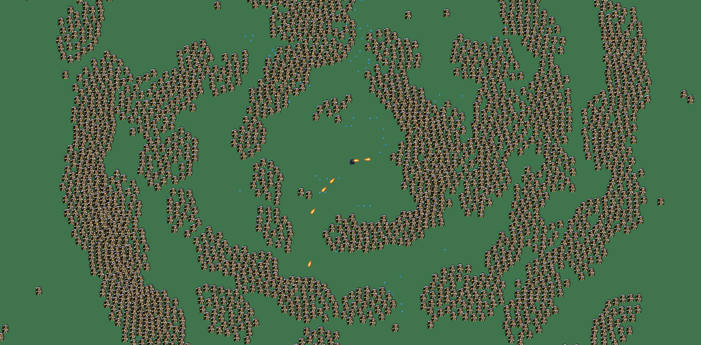
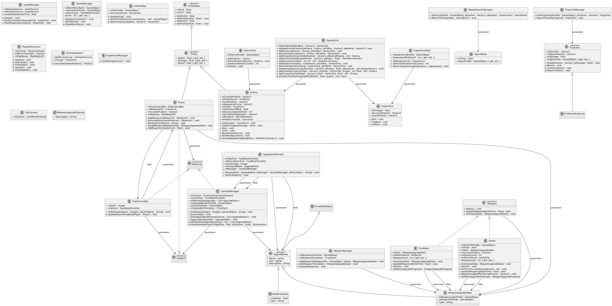
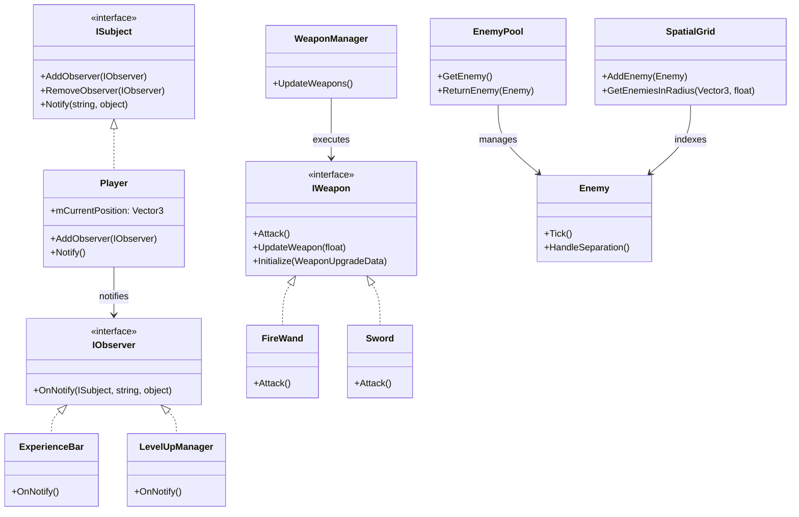
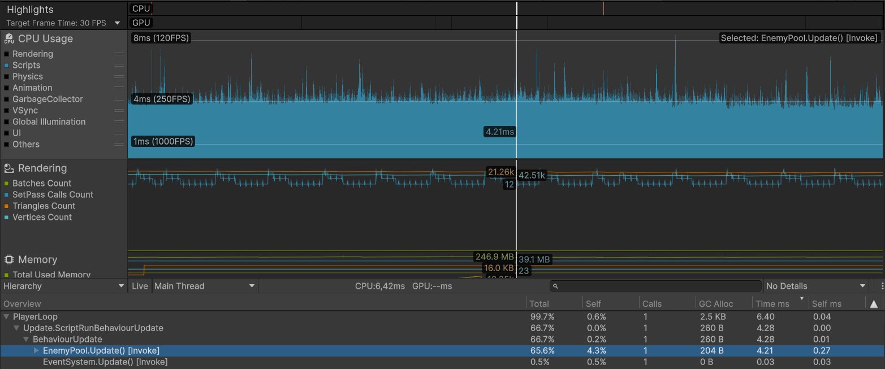
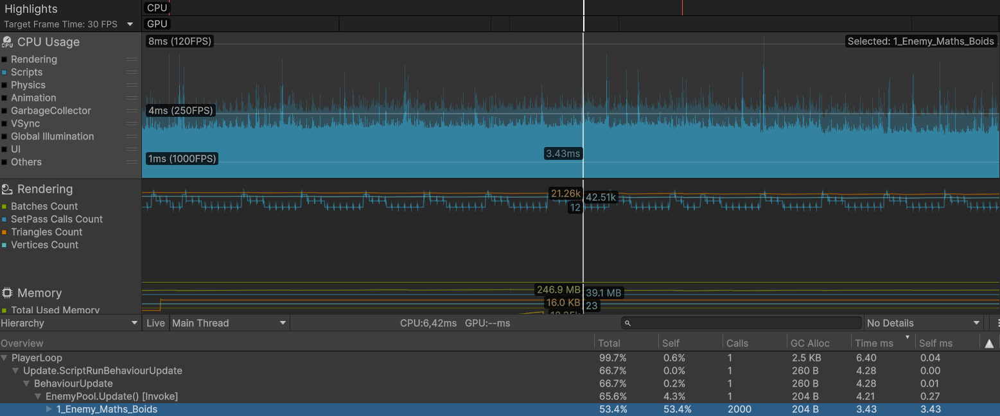
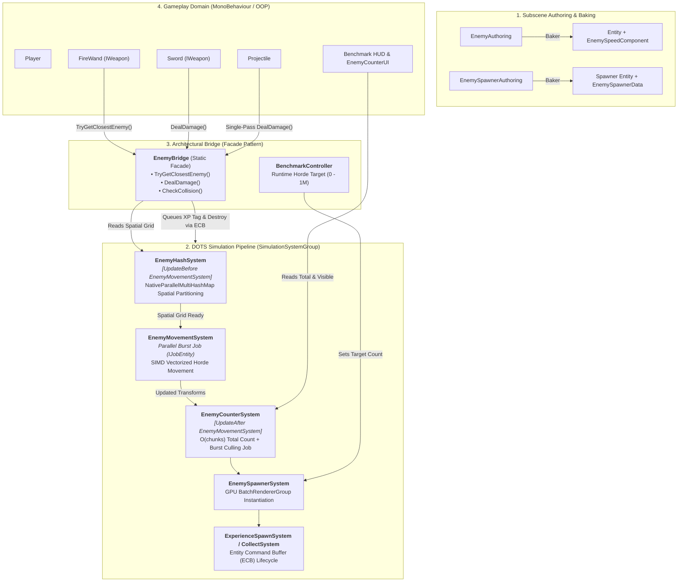

# Roguelike Benchmark: Classic OOP vs. Unity DOTS/ECS

[](https://unity.com/)
[](https://unity.com/dots)
[-green)](https://docs.unity3d.com/Packages/com.unity.burst@latest)
[](#phase-2-dotsecs-hybrid-architecture)
[](LICENSE)

A high-performance technical benchmark and portfolio project developed in **Unity 6**. The primary objective is to scientifically explore, measure, and analyze the architectural and hardware-level performance boundaries between **Classic Object-Oriented Programming (MonoBehaviour / OOP)** and **Data-Oriented Technology Stack (DOTS / ECS)** in a Survivor-like game context.



---

## Table of Contents
1. [Project Overview](#project-overview)
2. [Phase 1: Classic OOP Architecture & Profiling](#phase-1-classic-oop-architecture-profiling)
   - [OOP UML Class Diagram](#oop-uml-class-diagram)
   - [Key Architectural Patterns in OOP](#key-architectural-patterns-in-oop)
   - [Profiling & Identifying the Bottleneck](#profiling-identifying-the-bottleneck)
   - [OOP Benchmark Results](#oop-benchmark-results)
3. [Phase 2: DOTS/ECS & Hybrid Architecture](#phase-2-dotsecs-hybrid-architecture)
   - [Data-Oriented Pipeline & Hybrid Bridge Diagram](#data-oriented-pipeline-hybrid-bridge-diagram)
   - [Data-Oriented Design (DOD) Principles](#data-oriented-design-dod-principles)
   - [Core Systems Overview](#core-systems-overview)
   - [Decoupling with the EnemyBridge Facade](#decoupling-with-the-enemybridge-facade)
4. [Performance Comparison & Hardware Analysis](#performance-comparison-hardware-analysis)
5. [Engineering Standards & Best Practices](#engineering-standards-best-practices)
6. [Controls & In-Game Benchmark HUD](#controls-in-game-benchmark-hud)
7. [Tech Stack](#tech-stack)

---

<a id="project-overview"></a>
## Project Overview

In survivor-like horde games, rendering and updating tens of thousands of dynamic agents simultaneously is one of the most demanding challenges for game engines. 

This project implements the same game mechanics twice:
1. **First Implementation (OOP)**: Pushed to the theoretical limits of traditional Unity `MonoBehaviour` development using best-practice optimizations (Object Pooling, 2D Spatial Hash Grid, Time-Sliced Boids Steering).
2. **Second Implementation (DOTS/ECS)**: Re-engineered from the ground up using **Entities**, **C# Job System**, and the **Burst Compiler**, backed by GPU-driven batched rendering via `BatchRendererGroup`.

The project features a **real-time in-game benchmark controller** allowing runtime horde adjustments up to **1,000,000 entities** without code recompilation.

---

<a id="phase-1-classic-oop-architecture-profiling"></a>
## Phase 1: Classic OOP Architecture & Profiling

<a id="oop-uml-class-diagram"></a>
### OOP UML Class Diagram

The classic OOP implementation was architected around modular, decoupled subsystems with strict memory pooling:



<a id="key-architectural-patterns-in-oop"></a>
### Key Architectural Patterns in OOP



1. **Observer Pattern**: `Player` acts as `ISubject` notifying decoupled UI systems (`ExperienceBar`, `LevelUpManager`) without direct dependencies.
2. **Strategy Pattern for Weapons**: `WeaponManager` updates polymorphic weapons through the `IWeapon` interface. Weapon stats are data-driven via `ScriptableObject` assets (`WeaponUpgradeData`), enabling frictionless content expansion.
3. **Spatial Hash Grid**: Reduces collision and neighbor search complexity from $\mathcal{O}(n^2)$ to $\mathcal{O}(1)$ by mapping agent coordinates into discrete 2D hash cells.
4. **Strict Object Pooling**: Pre-allocates enemies, damage text, projectiles, and experience gems, reducing runtime allocations on the critical path to **0 – 1 KB per frame**.
5. **Boids-Inspired Horde Steering**: Blended vector steering combining *Seek* (player attraction) with a smoothed, time-sliced *Separation* vector (`Vector3.Lerp`) to prevent unnatural teleportation or overlapping.

---

<a id="profiling-identifying-the-bottleneck"></a>
### Profiling & Identifying the Bottleneck

Profiling with the Unity Profiler identified the primary bottleneck inside `EnemyPool.Update() -> Enemy.Tick()`:



Further deep-sampling of `Enemy.Tick()` revealed that the steering calculations (`1_Enemy_Maths_Boids`) accounted for more than **75% of the frame CPU time**:



Even with spatial grid lookups, neighbor caching, and 4-frame time-sliced separation updates, executing horde steering on a single thread hit a hard technical ceiling.

---

<a id="oop-benchmark-results"></a>
### OOP Benchmark Results

| Enemy Count | Frame Update Time (ms) | Target Frame Rate | Status / Playability |
|:---:|:---:|:---:|:---|
| **2,000** | 4.21 ms | > 144 FPS | Extremely smooth, perfectly stable |
| **4,000** | 8.94 ms | ~120 FPS | Minor drops below monitor refresh rate |
| **6,000** | 19.64 ms | ~60 FPS | Noticeable frame time increase; playable |
| **8,000** | 35.40 ms | ~30 FPS | Degraded responsiveness; functional limit |
| **10,000** | **45.59 ms** | **< 20 FPS** | **Unplayable (Hardware Ceiling Reached)** |

> **OOP Conclusion**: The limit of the OOP implementation is **~8,000–10,000 entities**. The root cause is not algorithmic inefficiency, but **hardware memory hierarchy**. OOP stores `GameObject` and `MonoBehaviour` instances as individual reference types scattered throughout the RAM. The CPU is constantly stalled by **Cache Misses** (pointer chasing), starving execution pipelines.

---

<a id="phase-2-dotsecs-hybrid-architecture"></a>
## Phase 2: DOTS/ECS & Hybrid Architecture

<a id="data-oriented-pipeline-hybrid-bridge-diagram"></a>
### Data-Oriented Pipeline & Hybrid Bridge Diagram

In DOTS, architecture shifts from class hierarchies to a **Data-Oriented Pipeline**. The high-level MonoBehaviour gameplay domain interfaces with the unmanaged ECS domain through an explicit **Facade / Bridge**:



---

<a id="data-oriented-design-dod-principles"></a>
### Data-Oriented Design (DOD) Principles

To break past the 10,000 entity ceiling, the simulation was converted to **Data-Oriented Design (DOD)**:

```
Traditional OOP (Array of Structures - Scattered Pointers):
[ Heap Object 1: Transform | Health | Speed | Sprite ] -> Pointer -> [ Heap Object 2 ] (Cache Misses)

DOTS / ECS (Structure of Arrays - 16KB Archetype Chunks):
Chunk 1: [ Transform | Transform | Transform ... ]  <-- Linear Cache Line Prefetching
Chunk 2: [ Speed     | Speed     | Speed     ... ]  <-- SIMD Vectorized Execution
```

- **Archetype Chunks**: Entities with identical component configurations are packed contiguously into memory chunks of 16 KB.
- **Cache Locality**: Iterating over linear arrays maximizes L1/L2 cache prefetching, minimizing RAM latency.
- **Burst Compiler**: Compiles C# code into highly optimized native machine assembly with auto-vectorization (SIMD / AVX2).

---

<a id="core-systems-overview"></a>
### Core Systems Overview

1. [`EnemyMovementSystem`](file:///C:/Users/mart1/Documents/Roguelike/Assets/Scripts/Enemy/EnemyMovementSystem.cs):
   - Burst-compiled parallel job (`IJobEntity`) computing directional vectors towards the player.
   - Zero heap allocation, fully multithreaded across all available CPU worker threads.
2. [`EnemyHashSystem`](file:///C:/Users/mart1/Documents/Roguelike/Assets/Scripts/Enemy/EnemyHashSystem.cs):
   - Partitions active enemies into a `NativeParallelMultiHashMap<int2, EnemyGridData>`.
   - Dynamic capacity scaling with hysteresis to prevent frequent native reallocations.
3. [`EnemySpawnerSystem`](file:///C:/Users/mart1/Documents/Roguelike/Assets/Scripts/Enemy/EnemySpawnerSystem.cs):
   - Uses `BatchRendererGroup` / `EntitiesGraphicsSystem` for GPU-instanced rendering.
   - Spawns enemies dynamically along camera edges in configurable batch sizes up to target horde limits.
4. [`EnemyCounterSystem`](file:///C:/Users/mart1/Documents/Roguelike/Assets/Scripts/UI/EnemyCounterSystem.cs):
   - Queries exact entity count instantly in $\mathcal{O}(\text{chunks})$ directly from archetype metadata (`mEnemyQuery.CalculateEntityCount()`), introducing zero frame delay and no thread contention.
   - Runs a Burst-compiled culling job (`CountVisibleEnemiesJob`) to report on-screen entity density.
5. [`ExperienceSpawnSystem`](file:///C:/Users/mart1/Documents/Roguelike/Assets/Scripts/Experience/ExperienceSpawnSystem.cs) & [`ExperienceCollectSystem`](file:///C:/Users/mart1/Documents/Roguelike/Assets/Scripts/Experience/ExperienceCollectSystem.cs):
   - Handles XP orb instantiation and magnet attraction towards the player through decoupled Entity Command Buffers (ECB).

---

<a id="decoupling-with-the-enemybridge-facade"></a>
### Decoupling with the EnemyBridge Facade

The [`EnemyBridge.cs`](file:///C:/Users/mart1/Documents/Roguelike/Assets/Scripts/Enemy/EnemyBridge.cs) facade completely decouples gameplay logic from unmanaged ECS:
- **No Leaky Abstractions**: Gameplay scripts (`FireWand`, `Projectile`, `Sword`) never import `Unity.Entities` or touch `World.DefaultGameObjectInjectionWorld`.
- **Encapsulated Grid Metrics**: Spatial cell size (`CellSize`) is declared `internal` to the simulation domain. High-level weapons simply query `EnemyBridge.TryGetClosestEnemy(origin, range, out target)`.
- **Single-Pass Projectile Collision**: Instead of performing multiple spatial queries per projectile per frame, `EnemyBridge.DealDamage` applies damage and returns the hit count in a single traversal, cutting collision detection overhead in half.

---

<a id="performance-comparison-hardware-analysis"></a>
## Performance Comparison & Hardware Analysis

| Metric | Classic OOP (MonoBehaviour) | Unity DOTS / ECS | Improvement Factor |
|:---|:---:|:---:|:---:|
| **Maximum Playable Entities (≥ 30 FPS)** | ~8,000 | **100,000+** | **> 12.5x** |
| **Horde Ceiling Tested** | 10,000 (< 20 FPS) | **1,000,000 entities** | **100x Scale** |
| **CPU Frame Time @ 2,000 Entities** | 4.21 ms | **< 0.45 ms** | **~9.3x Faster** |
| **CPU Frame Time @ 10,000 Entities** | 45.59 ms (Spike) | **< 1.80 ms** | **~25x Faster** |
| **Memory Allocation per Frame** | 0 – 1 KB | **0 Bytes** (100% Unmanaged) | Zero GC Pressure |
| **Thread Utilization** | Single Thread (Main Thread) | Full Multithreading (Job Worker Threads) | Near-linear scaling across cores |
| **Memory Layout** | Heap (Scattered pointers) | Contiguous Chunks (Cache-coherent SoA) | Eliminates CPU Cache Misses |

---

<a id="engineering-standards-best-practices"></a>
## Engineering Standards & Best Practices

The codebase follows strict software engineering and C# conventions:

- **Naming Conventions**:
  - `m` prefix for private/protected class fields (`mCurrentPosition`, `mSpatialGrid`).
  - `p` prefix for method and constructor parameters (`pDeltaTime`, `pTargetPosition`).
  - `l` prefix for local variables (`lPlayerPos`, `lCellRange`).
- **Memory Safety**:
  - All native containers (`NativeArray`, `NativeParallelMultiHashMap`, `NativeReference`) are tracked and properly disposed in `OnDestroy()`.
  - Existence checks (`EntityManager.Exists`) precede ECB structural change commands to eliminate unmanaged dangling pointer exceptions.
- **Documentation**:
  - 100% of public methods, systems, and structs are documented with standard XML docstrings in English.

---

<a id="controls-in-game-benchmark-hud"></a>
## Controls & In-Game Benchmark HUD

An interactive IMGUI HUD and keyboard hotkeys are included to inspect and control the benchmark at runtime:

| Hotkey / Control | Action | Details |
|:---:|:---|:---|
| **1 – 7** (Main / Numpad) | **Target Presets** | `1`: 1,000 &bull; `2`: 5,000 &bull; `3`: 10,000 &bull; `4`: 50,000 &bull; `5`: 100,000 &bull; `6`: 500,000 &bull; `7`: 1,000,000 |
| **+** / **-** | **Horde Step** | Adjust horde target by $\pm$ 10,000 (Hold **Shift** for $\pm$ 50,000) |
| **C** or **Delete** | **Clear All** | Instantly destroys all active enemies and XP orbs |
| **F1** | **Toggle HUD** | Shows / hides the on-screen benchmark interface |
| **Z, Q, S, D** / Arrows | **Movement** | Player controls |

---

<a id="tech-stack"></a>
## Tech Stack
- **Engine**: Unity 6 (6000.4.0f1)
- **DOTS Packages**: `com.unity.entities` (1.3.12), `com.unity.entities.graphics` (1.3.12), `com.unity.burst` (1.8.24), `com.unity.mathematics` (1.3.2)
- **Input System**: `com.unity.inputsystem` (New Input System)
- **Rendering**: Universal Render Pipeline (URP) with GPU Instancing
